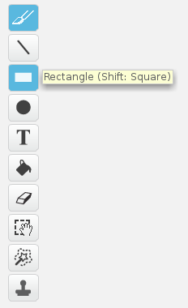

- In the Sprites panel, click on the paintbrush icon to **Paint new sprite**.

- Use the drawing tool in the **Costumes** tab to paint your new sprite.

- When you are finished, don't forget to give your new sprite a sensible name.

<video width="1024" height="768" controls>
<source src="images/screencast.webm" type="video/webm">
If your browser does not support WebM video, try FireFox or Chrome.
</video>
